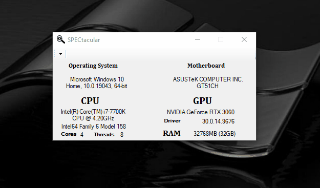

# Welcome to SPECtacular!
SPECtacular is a tool created to obtain the specifications of your PC in a nice clean format. SPECtacular uses WMI (Windows Management Instrumentation) to be able to read the hardware details. This project was created to see how a C# program can interact with hardware and serves as a basic for another project I have in mind. However, I would also like to share this project. It is currently in it's pre-release stage and currently only has the basic view, but I will be adding a detailed/advanced view in the future!

Twitter @_Ozz

Github 4czr

Email ozz@riseup.net

# Version
SPECtacular is currently in version **0.1**

# What's To Come?
- Detailed/Advanced View for a lot more system information
- May re-do the GUI
- More...
